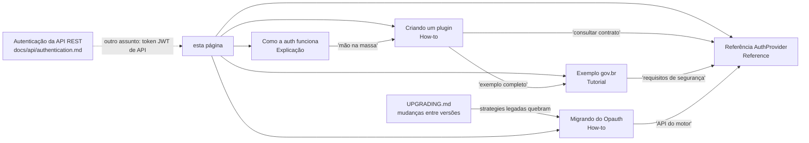

# Plugins de Autenticação — Mapas Culturais 8.0

Como criar, configurar e migrar provedores de autenticação para o Mapas Culturais
da linha 8.x: estendendo `AuthProvider`, registrando via `config.php`, compondo
`league/oauth2-client` diretamente e convivendo com o login local do core.

> **Versão**: 8.0 (`develop-8.0`+). Para o que mudou entre versões (motor
> Opauth → league, login local no core, breaking changes), veja
> [UPGRADING.md](../../../UPGRADING.md).

## Visão geral do motor (linha 8.x)

- **Contrato público**: classe abstrata `MapasCulturais\AuthProvider`
  (`src/core/AuthProvider.php`) + hooks `auth.*` + config `auth.provider` /
  `auth.config`. O helper `MapasCulturais\Auth\OAuth2ClientHelper` é
  **`@internal`** — plugins externos não dependem dele.
- **Motor OAuth2/OIDC do core**: `league/oauth2-client ^2.9` +
  `firebase/php-jwt ^7.0.5` (`composer.json`). Plugins externos declaram essas
  dependências no próprio `composer.json` e compõem as bibliotecas
  diretamente.
- **Login local no core**: módulo `LocalAuth` + driver `Local`, controlado por
  `AUTH_LOCAL_LOGIN_ENABLED` (default `true`). Convive com qualquer
  `auth.provider` social — ou pode ser desligado por completo.

## Índice

| Documento | Tipo | Quando ler |
|---|---|---|
| [Como a autenticação funciona](./how-auth-works.md) | Explicação | Você quer entender a arquitetura: drivers, ordem de boot, login local, sessões |
| [Criando um plugin de autenticação](./creating-auth-plugin.md) | How-to | Você vai criar um provider próprio e quer a receita passo a passo |
| [Exemplo completo: gov.br](./example-govbr.md) | Tutorial | Você quer construir, ponta a ponta, um plugin gov.br-only sem login local |
| [Referência do AuthProvider](./authprovider-reference.md) | Referência | Você precisa consultar métodos, hooks, chaves de config e rotas |
| [Migrando de strategies Opauth](./migrating-from-opauth.md) | How-to | Você mantém uma strategy Opauth legada e precisa portá-la para o motor novo |

## Mapa de navegação

> **Note**: esta documentação cobre a autenticação de **login** (quem entra no
> site). A autenticação da **API REST** (JWT de `UserApp`) é outro mecanismo —
> veja [docs/api/authentication.md](../../api/authentication.md).

## Perguntas rápidas

- **Quero trocar o provedor de login da minha instância** (não desenvolver um
  plugin): veja [Como a autenticação funciona](./how-auth-works.md) e o
  `config/authentication.php` do repo — `auth.provider` aponta o driver.
- **Meu plugin MultipleLocalAuth continua funcionando?** Sim — entra em modo
  manutenção e o módulo `LocalAuth` do core faz *stand-down* automático
  ([UPGRADING.md](../../../UPGRADING.md), seção "Coexistência com o
  MultipleLocalAuth").
- **Vim de uma strategy Opauth** (ex.: `opauth-authentik` de terceiros): ela
  **deixa de funcionar** no core — veja
  [Migrando de strategies Opauth](./migrating-from-opauth.md).

## Ver também

- [UPGRADING.md](../../../UPGRADING.md) — mudanças de comportamento e breaking
  changes da refatoração de autenticação.
- [Referência do AuthProvider](./authprovider-reference.md) — contrato completo
  com rastreabilidade `arquivo:linha`.
- Código dos drivers do core como exemplos canônicos:
  `src/core/AuthProviders/OpauthLoginCidadao.php` (OAuth2 puro),
  `src/core/AuthProviders/OpauthAuthentik.php` (OIDC com ID token).
